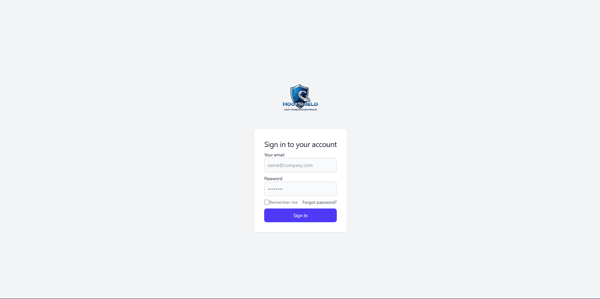

# Hookshield - Système de Protection contre le Phishing

## 1. Présentation du Projet

Hookshield est une application de cybersécurité développée dans le cadre du cours 8INF970 - Atelier pratique en cybersécurité II. Ce projet vise à analyser et bloquer les emails potentiellement malveillants en utilisant une approche basée sur l'intelligence artificielle et des techniques avancées d'analyse de mails.

### Membres de l'équipe
- **Romain Argaud**
- **Remy Etienne**
- **Malo Galabert de Clercq**
- **Julot-Dejabris Ngongang Kemajou**
- **Jony Pierre**

---

## 2. Architecture du Projet

### Technologies Utilisées
- **Frontend** : Vue.js (JavaScript)
- **Backend** : FastAPI (Python)
- **Base de données** : MariaDB
- **IA** : Modèles d'apprentissage automatique intégrés via FastAPI (Python)

### Fonctionnalités Clés
- Connexion OAuth pour Gmail, IMAP pour les autres services de messagerie
- Analyse des emails en temps réel
- Blocage des emails malveillants
- Statistiques et gestion des adresses mail
- Interface administrateur avec liste noire et gestion des faux positifs

### Flux de Traitement des Emails
1. **Récupération des emails** : Via Gmail Pub/Sub pour Gmail, via un écouteur IMAP pour les autres services.
2. **Stockage des emails** : Sauvegarde dans MariaDB.
3. **Analyse IA** : Classification en phishing ou non-phishing.
4. **Actions associées** : Notification, blocage, ou signalement.

---

## 3. Installation et Lancement

### Prérequis
- **Docker**
- **Cuda (version compatible avec Pytorch)**
- **Python 3.10**

### Installation
1. **Clonage du dépôt**
   ```sh
   git clone https://github.com/Romain9745/AtelierCyber2.git
   cd AtelierCyber2
   ```
2. **Démarrage de l'application** (avec Docker)
   ```sh
   docker-compose up -d
   ```
3. **Démarrage de l'IA** (sans Docker)
L'IA n'a pas été conteneurisé car elle doit tourner sur un GPU, ce qui la rend trop dépendant de l'hardware de chaque ordinateur sur lequel elle tourne
   ```sh
   cd IA_api
   python -m . ./venv
   ./venv/Scripts/activate #pour activer l'environnement virtuel
   pip install requirements.txt
   ```
Si vous n'avez pas de carte graphique, vous pouvre directement lancer l'application :
   ```sh
   cd app
   python ./main.py
   ```
Cependant les performences rendront l'application inutilisable.

Si vous avez une carte graphique Nvidia :
- Assurez vous d'avoir une version de cuda compatible avec Pytorch (11.8, 12.4, 12.6) sinon installez une de ces versions
- En fonction de votre version, upgradez la version Pytorch en conséquence :
```sh
   pip3 install torch torchvision torchaudio --index-url https://download.pytorch.org/whl/cuXXX
   ```
En remplacant le XXX car votre version de cuda (118 pour 11.8 par exemple).

Vous pouvez maintenant lancer l'application (les tests ont été fait avec une gti 1660 TI donc avec moins de 6VGRAM pas sûr que ça fonctionne) :
```sh
   cd app
   python ./main.py
   ```


---

## 4. Utilisation

Au démarrage, un premier compte administrateur est automatiquement créé avec les identifiants suivants :  
- **Email** : `johndoe@gmail.com`  
- **Mot de passe** : `password`  

L'application est accessible à l'adresse : [http://localhost:4173](http://localhost:4173)  

### Connexion  

À l'ouverture, vous serez redirigé vers la page de connexion. Utilisez le compte ci-dessus pour vous connecter :  

  

### Accueil  

Une fois connecté, vous constaterez qu'aucun email n'est bloqué. C'est normal : aucune boîte mail protégée n'a encore été ajoutée.  

  

### Ajout d'un compte mail  

Pour commencer, ajoutez un compte mail à protéger. Cliquez sur **"Gestionnaire d'adresses"** dans le menu :  

  

Cliquez sur **"Ajouter"** et sélectionnez la méthode de connexion **IMAP** (la seule fonctionnelle) :  

  

Saisissez vos informations de connexion. Assurez-vous que votre serveur IMAP est compatible et accessible :  

  

Une fois l'ajout effectué, votre compte apparaît dans la liste :  

  

### Test du filtrage  

Pour tester le fonctionnement de l'application (en attendant le déploiement de l'IA), ajoutez l'adresse e-mail émettrice à la **blacklist** pour bloquer ses messages :  

  

Envoyez ensuite un mail depuis cette adresse **blacklistée** vers votre adresse protégée. Vous devriez voir qu'il a bien été bloqué :  


## Tickets

Il est possible d'envoyer des requêtes aux administrateurs pour contester la classification d'un mail comme phishing, il suffit de :
- Clicker sur le mail dans l'accueil pour le visualiser et cliquer sur "Déclarer comme non phishing" :

- Donner une explication et soumettre le ticket :

- Il apparaît désormais sous le tableau ticket où l'on peut le suivre afin de connaitre la décision des administrateurs:

- Un administrateur peut quant à lui voir la demande et l'accepter (ou la refuser) :


## 5. Répartition des Tâches
Le projet est divisé en plusieurs modules, chacun assigné à des membres de l'équipe :

- **Base de données & API Backend** : Conception des modèles et routes API.
- **Analyse des emails & Intelligence Artificielle** : Développement des algorithmes de classification.
- **Interface utilisateur** : Conception sous Figma, développement en Vue.js.

Un diagramme de Gantt est utilisé pour suivre l'avancement des tâches.

---

## 6. Conclusion
Hookshield est une solution complète pour la détection et la gestion des emails de phishing, combinant des technologies modernes pour offrir une protection efficace contre les cyberattaques.

**Contact & Support**
Pour toute question ou contribution, contactez l'équipe via GitHub ou par email.

---

**Version : 1.0**

**Licence : MIT**


